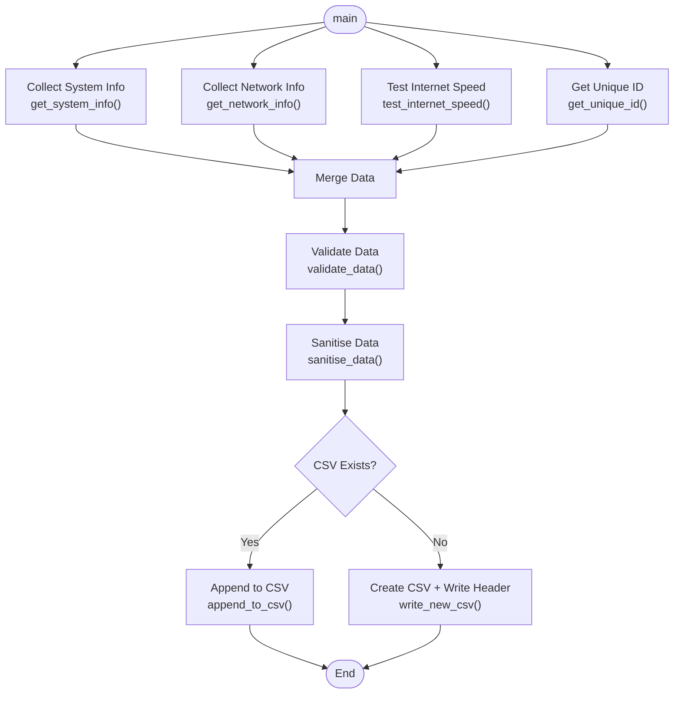

# Computer Fingerprint Collector  
### Cross‑Platform System & Network Information Automation Script

This project automates the collection of system and network information from Windows and Linux machines.  
It was developed as part of the **Midtown IT Automation & Scripting Assessment** and is designed using **defensive coding**, **cross‑platform compatibility**, and **zero third‑party dependencies**.

---

## 📑 Table of Contents

- [Project Overview](#️-computer-fingerprint-collector)
- [Features](#-features)
- [Repository Structure](#-repository-structure)
- [How to Run](#️-how-to-run-the-script)
- [Script Flow Diagram](#-script-flow-diagram-mermaid)
- [Sample Output](#-sample-output)
- [Debugging Documentation](#-debugging-documentation)
- [Documentation](#-documentation)
- [Status](#️-status)
- [Author](#-author)

---

## Features

- Collects detailed **system information**  
- Collects **network information** (IP, MAC, active ports)  
- Performs a lightweight **internet connectivity test**  
- Generates a **unique system identifier**  
- Validates and sanitises all collected data  
- Outputs to a **CSV file compatible with Excel**  
- Works on **Windows 10/11** and **Linux distributions**  
- Uses **Python standard library only**  
- Designed with **modular, maintainable functions**  
- Includes **debugging documentation** and **sample outputs**

---

## Repository Structure

- [src/](src/)  
- [docs/](docs/)  
  - [pseudocode.md](docs/pseudocode.md)  
  - [requirements.md](docs/requirements.md)  
  - [debugging.md](docs/debugging.md)  
  - [images/](docs/images/)  
- [samples/](samples/)  
  - [sample_output.csv](samples/sample_output.csv)  
- [README.md](README.md)

---

## How to Run the Script

This script collects system and network information and saves the results into a CSV file.

### **1. Requirements**
- Python 3.x  
- No third‑party libraries  
- Permission to run Python scripts  

---

### **2. Download or Clone the Repository**

```bash
git clone https://github.com/AlAbbas-cloud/computer-fingerprint-collector.git
cd computer-fingerprint-collector/src
```
---

### **3. Run the Script**
**Windows**
```bash
python computer_fingerprint_collector.py
```
**Linux / macOS**
```bash
python3 computer_fingerprint_collector.py
```
---

### **4. Output Location**
A file named:
```code
computer_fingerprints.csv
```
will be created or updated in the same folder.

Each run appends a new row containing:

- Computer name
- IP address
- MAC address
- Processor model
- Operating system
- System time
- Internet speed
- Active ports
- Unique ID

---

## Script Flow Diagram (Mermaid)



---

## Sample Output
A sample CSV output from real test runs on Windows 10, Windows 11, and Linux is available in:

```Code
/samples/sample_output.csv
```

---

## Debugging Documentation
Full debugging notes and screenshots are available in:

```Code
/docs/debugging.md
```
This includes:

- Breakpoints
- Call stack analysis
- Watch expressions
- Speedtest debugging
- System info function debugging
- justMyCode deep debugging

---

## Documentation

- **Pseudocode:** /docs/pseudocode.md
- **Requirements:** /docs/requirements.md
- **Debugging:** /docs/debugging.md

---

## Status
This project is complete and meets all requirements for:

- Midtown IT Automation Assessment
- Cross‑platform compatibility
- Defensive coding standards
- Professional documentation

---

## Author
**Ali Abbas**
Cybersecurity & Automation Student
TAFE Queensland
