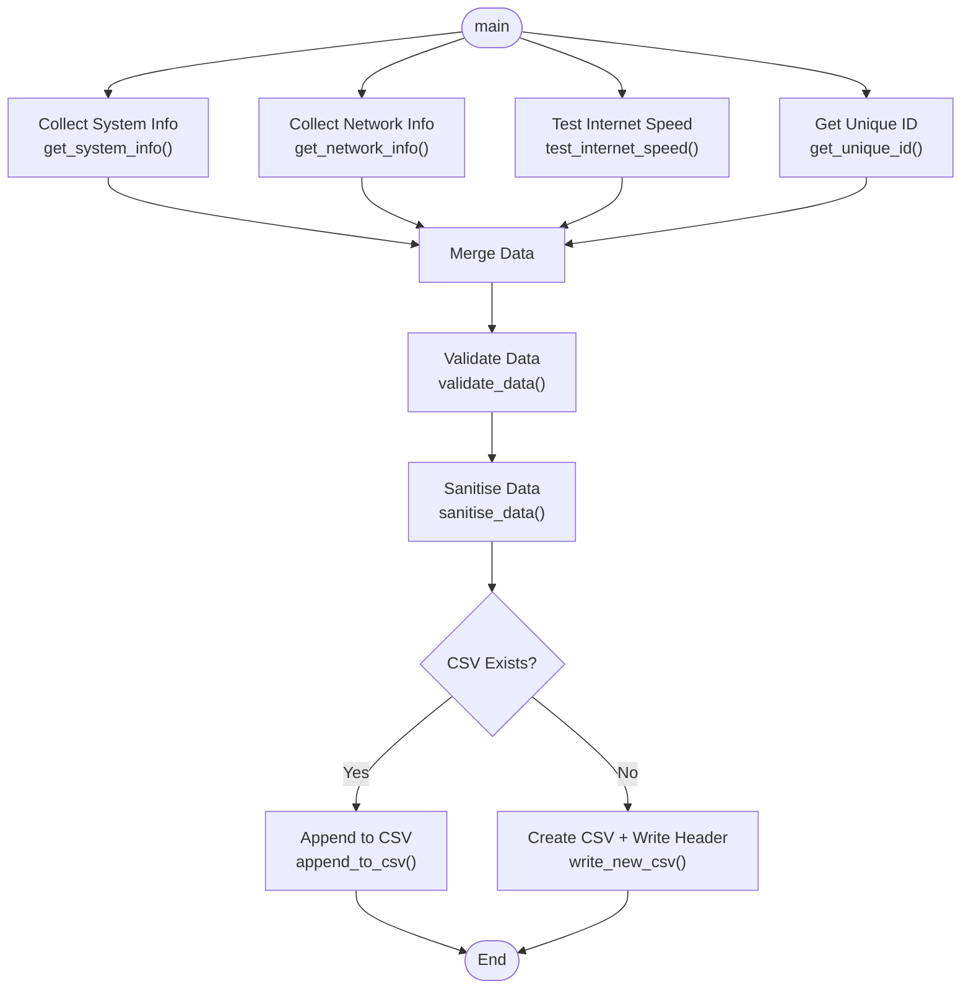

# Pseudocode - Computer Fingerprint Collector

This document contains the full pseudocode and logic explanation for the Computer Fingerprint Collector script.  
It follows a clear, language‑independent structure and aligns with the final approved solution.

---

## Script Architecture (Mermaid)


---

## High‑Level Algorithm

```code
BEGIN

SET current_time = get current system time
SET computer_name = get computer name
SET ip_address = get IP address
SET mac_address = get MAC address
SET processor_model = get processor model
SET operating_system = get OS name and version
SET internet_speed = test internet download speed
SET active_ports = get list of open ports
SET unique_id = get system UUID or serial number

VALIDATE all collected data
SANITISE data to remove unwanted characters

IF CSV file exists THEN
APPEND new row with collected data
ELSE
CREATE new CSV file with headers
ADD collected data as first row
ENDIF

END
```

---

## Control Structures Used

### **Sequence**
All data collection steps run in a fixed order:
1. System info  
2. Network info  
3. Internet speed  
4. Unique ID  
5. Validation  
6. CSV writing  

### **Selection (Decision Making)**
Used to determine whether to create or append to the CSV:

```bash
IF file exists → append
ELSE → create new file
```

### **Iteration**
Used when:
- Parsing active ports  
- Reading existing CSV entries  

### **Termination**
The algorithm ends after writing to the CSV file.

---

## Desk Check Summary

### **Test Case 1 — New Computer**
- CSV does not exist → create file  
- Add first row  
- No warnings  

### **Test Case 2 — Existing Computer, Data Changed**
- CSV exists  
- Computer found  
- Differences detected → warnings shown  
- CSV not updated  

### **Test Case 3 — Existing Computer, No Changes**
- CSV exists  
- No differences  
- No update required  

---

## Notes

- Pseudocode is platform‑independent  
- Matches the final Python script structure  
- Designed using defensive programming principles  
